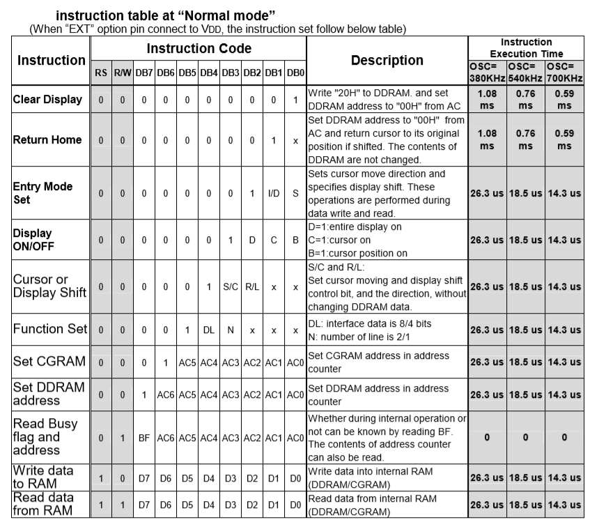

# mbed + LCD(AQM0802A) でオリジナルキャラクタ(自作文字)の表示

mbed + AQM0802A ピッチ変換モジュール(完成品) で自作文字(オリジナルキャラクタ)の表示のやり方メモ.

* 秋月電子通商
    * Ｉ２Ｃ接続小型ＬＣＤモジュール（８×２行）ピッチ変換モジュール（完成品）
    * http://akizukidenshi.com/catalog/g/gM-09109/

通常のキャラクタ表示はライブラリ検索 `AQM0802A` で調べれば先人達が作成した素敵なライブラリが公開されていますが,
オリジナルのキャラクタを作成して表示しようとするとそのための便利ライブラリはなく, データシートを読んで自前実装が必要でした.
結構ちゃんとデータシートを読まなければならず, まあ, 当然英語でして...うぐぅ, 頑張って読んで何とかオリジナルのキャラクタの
表示までできたので自分用のメモとして本ブログをしたためます.

また、SC1602 シリーズの LCD が大体同じような感じでオリジナルキャラクタを表示できるっぽいので AQM0802A に限らず
役立つノウハウな気がします.

## 参考
参考にしたサイトおよびデータシートです.

* AQM0802A のデータシート
    * たぶん秋月さんが ST7032i の重要な箇所だけピックアップしてまとめたと思われるもの
    * http://akizukidenshi.com/download/ds/xiamen/AQM0802.pdf
* コントロールIC ST7032i のデータシート
    * ディスプレイを制御している IC
    * マイコンは I2C により ST7032i にデータやコマンドを送信し, それを受け ST7032i がディスプレイを制御する
    * http://akizukidenshi.com/download/ds/sitronix/st7032.pdf

## 環境

* Windows10
* mbed EA LPC11U35
    * ユーザープログラムを実行するマイコン
* AQM0802A(LCD)
    * ピッチ変換モジュール（完成品）


## I2C について
mbed からは I2C による通信で AQM0802A を制御します.
正確には AQM0802A に搭載されている ST7032i という IC が I2C で受信したデータやコマンドを元にディスプレイを制御します.

mbed から AQM0802A にデータやコマンドを送信する際のフォーマットにはルールがあり大まかに以下です.

1. 初めに Slave アドレスを 0x7C を送信する
    * Slave アドレスは固定
    * サイズは 1byte
1. 続いて control byte を送信する
    * 次に送信する data byte がコマンドの指令かデータの書き込みかを決める
        * コマンドには Clear Display や Return Home など色々
    * control byte には Co, RS のビットがあるが詳細は後述
    * Co, RS 以外のビットは 0 固定
    * サイズは 1byte
1. 続いて data byte を送信する
    * コマンドの場合は実行するコマンドを決める
    * データの場合はデータを送信する
    * サイズは 1byte


## パラメータの説明
以上のフォーマットに従って AQM0802A を I2C で制御するわけなのですが, いろんなパラメータが登場し
それらが何なのかある程度把握してないと操作の仕方がそもそもわからないです.
とりあえずオリジナルのキャラクタを表示するのに必要な最低限を解説します.

### Co
連続でデータを送信する際に最終 byte を決めるためのビット. control byte の 7bit 目に割り当てられている.
control byte と data byte を1セットとし数セット連続で送信可能ですが, その場合受け手が最終セットの判断がつかないため,
最終セットの Co のみ 0 を設定することにより受け手に最後の1セットを伝える.

control byte と data byte を1セットしか送信しない場合はそれがすなわち最終セットとなるため Co=0 となります.

### RS
data byte を IR(Instruction Register) に書き込むか DR(Data Register) に書き込むか決めるビット.
control byte の 6bit 目に割り当てられている.
要するに「ディスプレイを消去しろ」や「カーソルを先頭に戻せ」など何らかのコマンドを送信したい場合は RS=L とし
データを書き込む場合は RS=H とします. コマンドを送信したいかデータを書きたいかを決めるビットです.

### Address Counter(AC)
後述の DDRAM/CGRAM/ICON RAM のアドレスを記憶する.
DDRAM/CGRAM/ICON RAM を書き込んだ後、AC は自動的に 1 加算される.

### Display Data RAM(DDRAM)
表示するデータを 8bitキャラコードとして保持する RAM.
DDRAMアドレスカウンターは AC に16進数として設定される.

### Character Generator RAM(CGRAM)
オリジナルキャラクタ作成時のキャラクタパターンを指定するための RAM.
この RAM にパターンを書き込むことによりオリジナルキャラクタを作成する.

## 起動時の設定
起動時に所定のおまじないをする必要がある. 内容は AQM0802A のデータシート「初期設定例」に記載の通り
決まったコマンドを決まった順序で送信する. コマンドとコマンドの間は一定時間の wait を設ける必要がある.

初期設定についてはデータシートに記載の通りなのと, 先人達のソースを見ればわかるため本記事では取り上げません.

## 通常のキャラクタ表示
データシートの「CHARACTER PATTERNS」に載っている, 既に定義済み文字の表示手順説明です.
通常の文字であればすでに公開されているライブラリが使いやすいインタフェースを提供してくれているので自前実装する必要はないんですが,
AQM0802A への I2C を使った基本的なコマンド送信方法の説明も兼ねて書こうかと思います.

実際に2行目左から4番目の位置に 'K' を表示する手順で説明します. 以下のイメージです.

□□□□□□□□<br>
□□□K□□□□<br>

### Set DDRAM address で書き込み位置を指定
「Set DDRAM address」が「コマンド」にあたります. 各コマンドの送信方法は AQM0802A データシート記載の「DISPLAY INSTRUCTION TABLE」
一覧に載っています.
Set DDRAM address で指定するアドレスとは AQM0802A ディスプレイの 8x2 のどの位置に文字を表示するかになります.
表示位置と DDRAM アドレスの対応は AQM0802A データシートの「液晶表示 DDRAMアドレス」から判断します.




表示位置は2行目の4番目なので「液晶表示 DDRAMアドレス」一覧から 0x43 が該当します.

### Write data to RAM で書き込む文字を指定
書き込み位置が決まったら次に「Write data to RAM」により表示する文字のコードを送信します.
データ送信の場合は control byte の RS に 1 を設定します.
文字コードは「CHARACTER PATTERNS」一覧に記載の値ですが, 通常の ASCII でも表示可能です.

### サンプルコード
以上を踏まえると mbed ソースは以下のような感じです.
Slave アドレス以降は control byte と data byte の送信を交互に繰り返す感じですね.

```cpp
int main()
{
    // I2C の初期化
    i2c = new I2C(p26, p25);
    i2c->frequency(400000);    // I2C bus speed

    // 初期化コマンドシーケンス
    // 初期化シーケンスについては本記事では取り上げない
    init_seq();

    char buf[4];
    // Slave address
    const unsigned char slave_addr = 0x7C;

    // control byte
    // Co=1, RS=0
    // RS=0 はコマンドの指定となる
    buf[0] = 0x80;
    // data byte
    // Set DDRAM address 0x80(0b1XXXXXXX)
    // DDRAM Address 0x43
    buf[1] = (char)(0x80 | 0x43);

    // control byte
    // Co=0(最終データ), RS=1
    // RS=1 はデータの送信
    buf[2] = 0x40;
    // data byte
    // Write Data to RAM
    buf[3] = 'K';

    // I2C 送信
    i2c->write(slave_addr, buf, sizeof(buf));

    while(1) {
    }
}
```

## オリジナルのキャラクタ表示
本題のオリジナルキャラクタを作成して表示する手順です.
画像のオリジナルキャラクタ(にこにこハート)を表示します.


表示手順は大まかに以下です.

1. オリジナルキャラクタを設定するキャラクタコードを決める
1. オリジナルキャラクタのドットパターンを CGRAM に設定する
1. 作成したオリジナルキャラクタを表示する

データシート, 「CHARACTER PATTERNS」の「CGRAM」と書かれた箇所がオリジナルのキャラクタ登録用に
割り当てられたコードです. このいずれかのコードにこれから作成するオリジナルのキャラクタを紐付けます.


どのコードに割り当てるかは ST7032i データシートの 「Table4 Relationship between CGRAM Addresses 〜」 を
見て判断します.


CGRAM address の 5bit - 3bit がどのコード(DDRAM data)に登録するかを決定します.
2bit - 0bit が CGRAM に書き込むドットパターンの行を決めます.
つまり コード 0x00 にオリジナルキャラクタを設定する場合は CGRAM address 0x00 - 0x07 に
ドットパターンを登録します. CGRAM address の指定コマンドは「DISPLAY INSTRUCTION TABLE」の「Set CGRAM」が該当します.
一度 CGRAM address を決めれば AC は自動的にインクリメントされるため以降は CGRAM address の指定を省けます.

CGRAM へのドットパターンの書き込みが完了したら、そのコードに作成したキャラクタが登録されますので,
通常のキャラクタ表示と同じ要領でそのコードを表示すればよいわけです.

そして実際にコードに落とし込んだのが以下.

```cpp
char pattern1[8] = {0b00000110,
                    0b00001001,
                    0b00010010,
                    0b00010010,
                    0b00001000,
                    0b00000101,
                    0b00000010,
                    0b00000001
                   };

char pattern2[8] = {0b00001100,
                    0b00010010,
                    0b00001001,
                    0b00001001,
                    0b00000010,
                    0b00010100,
                    0b00001000,
                    0b00010000
                   };

int main()
{
    // I2C の初期化
    i2c = new I2C(p26, p25);
    i2c->frequency(400000);    // I2C bus speed

    // 初期化コマンドシーケンス
    init_seq();

    char buf[128];
    // Slave address
    const unsigned char slave_addr = 0x7C;
    int i = 0;

    // control byte
    // Co=1, RS=0
    buf[i] = 0x80;
    i++;
    // data byte
    // Set CGRAM address
    // 初回に設定以降、AC は自動的にインクリメントされるため
    // 続きはドットパターンのデータ設定のみ
    buf[i] = (0x40 | 0x00);
    i++;

    // CGRAM にドットパターンのデータを設定する
    int j;
    for(j = 0; j < 8; i += 2, j++) {
        // control byte
        // Co=1, RS=1
        buf[i] = 0xC0;
        // data byte
        // ドットパターンを書き込み
        buf[i+1] = pattern1[j];
    }
    for(j = 0; j < 8; i += 2, j++) {
        // control byte
        // Co=1, RS=1
        buf[i] = 0xC0;
        // data byte
        // ドットパターンを書き込み
        buf[i+1] = pattern2[j];
    }

    // control byte
    // Co=1, RS=0
    buf[i] = 0x80;
    i++;
    // data byte
    // Set DDRAM address
    // 2行目4番目に表示する
    buf[i] = (0x80 | 0x43);
    i++;

    // contorol byte
    // Co=1, RS=1
    buf[i] = 0xC0;
    i++;
    // data byte
    // Write data to RAM
    // 作成した pattern1 の Character Code
    buf[i] = 0x00;
    i++;
    // contorol byte
    // Co=0, RS=1
    buf[i] = 0x40;
    i++;
    // data byte
    // Write data to RAM
    // 作成した pattern2 の Character Code
    buf[i] = 0x01;

    int size = i + 1;

    // I2C 送信
    i2c->write(slave_addr, buf, size);

    while(1) {
    }
}

```

## おわり
オリジナルのドット文字を表示できるようになったら無性にゲームボーイ的な何かを作りたくなりますね.
そのうち安価なパーツだけを駆使してオレオレゲームボーイをつくるのもありですね.

そして全く触れなかった ICON RAM についてもそのうち掘り下げたい...
