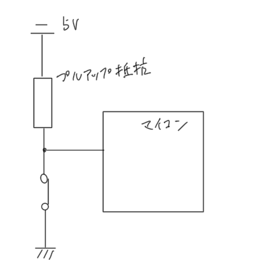
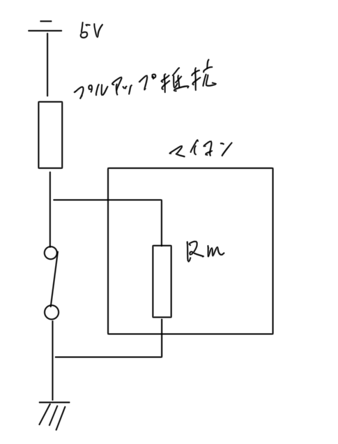
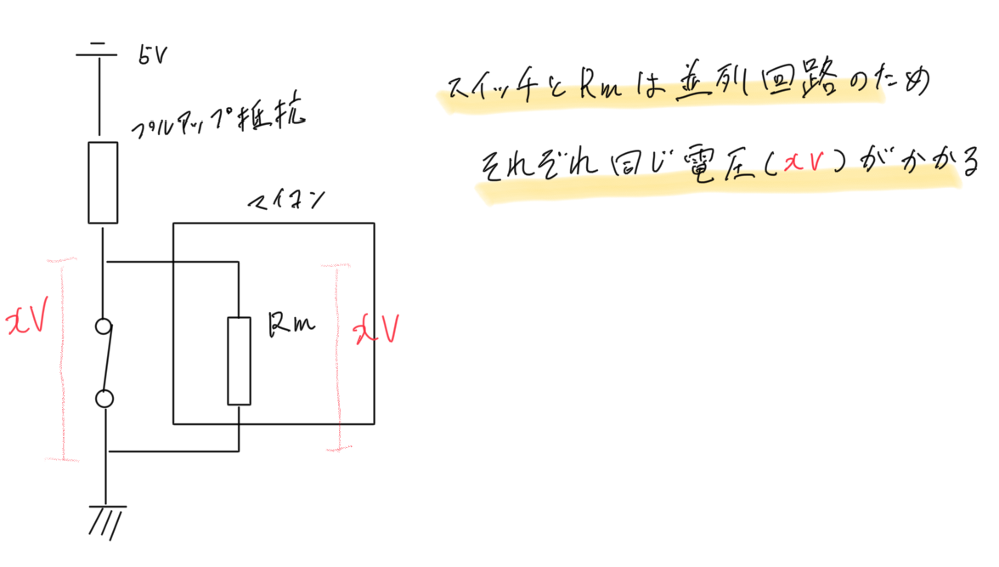
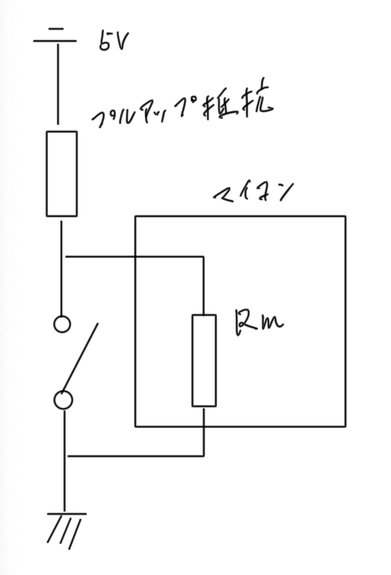
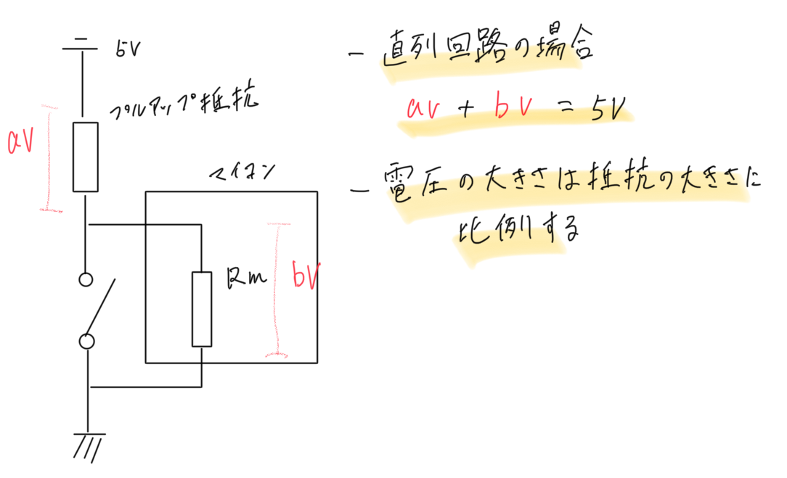

# 電気素人のプルアップ回路解説

## ブログの内容

プルアップ回路についてざっくり以下のように暗記していますが正直その原理が不明でした. 

* スイッチが OFF 時にマイコン入力状態が ON になる
* スイッチが ON 時にマイコン入力状態が OFF になる

というのも, 例えば以下のような 5V 電源の回路の場合, スイッチが OFF 時マイコンの入力端子には 5V が印加される...というのは理解できます. 
スイッチが ON の場合はマイコン入力端子には 0V が印加される...なぜ?電源と回路的につながっているため 5V が印加されるのでは?と考えてしまいます.

このあたりについて, あまりどのブログにも原理が書かれておらず, おそらくは基本的な内容のためわざわざ書いていないのではないかと思われます. 
そこまで基本的な原理であれば恐らくは義務教育で習う範疇の知識ではないかと思ったので中学2年の理科の教科書をやりなおした後, プルアップ回路についてリベンジしてみました. 

その結果, 一応, 自分なりには結論を導き出せた気分なので, それを本ブログにまとめます. 

なお, プルアップ回路については以下の「プルアップ・プルダウン抵抗とは？電子回路に必須の考え方」を参考にさせていただきました. 
本ブログは以下のページを読んだ上で, 電気まわりで不明点がある場合に読んでいただくと良いかと思います. 

https://voltechno.com/blog/pullup-pulldown/

## プルアップ回路とは

ここではプルアップ回路の利用意図について説明しますが詳細については参考サイトの「プルアップ抵抗・プルダウン抵抗とは？電子回路に必須の考え方」を参照してください. 

マイコンの入力端子は常に電源側かグランド側に接続しなければならず, どちらにも接続されていない浮いた状態(ハイインピーダンス)になってはいけません. 
プルアップ, プルダウン回路はマイコンの入力端子が浮いた状態にならないようスイッチが ON/OFF どちらの状態でも
マイコン入力端子を Hi/Lo いずれかに倒すための回路です. 

## スイッチ ON 時の原理

それではプルアップ回路でのスイッチ ON 時にマイコンの入力端子に 0V が印加される自分なりの考察を説明します. 

まず以下の前提があります. 

* 電源電圧は 5V
* プルアップ抵抗とマイコン入力端子の抵抗(Rm)ではマイコン入力端子の抵抗のほうが遥かに大きい
* スイッチが閉じられた時のスイッチの抵抗はほぼ 0Ω とする

この図では抵抗は以下の3つが存在します. 

* プルアップ抵抗
* 閉じられたスイッチ
* マイコンの入力端子抵抗
    * 抵抗 Rm とする

ここで求めたいこととしてはスイッチ ON 時の Rm にかかる電圧になります. 

Rm とスイッチは並列回路のためスイッチと Rm のそれぞれにかかる電圧は等しくなります. 
そのため, スイッチにかかる電圧を求めると Rm の電圧がわかります. 

なぜ並列回路のそれぞれの抵抗にかかる電圧が等しくなるかのメカニズムまでは私にはわかりません. 
とりあえず中学2年の理科の教科書でそのように書いているためそうとしています. 
ただ実地で考えてもテスタなどで電圧を計測する際は並列につないで計測対象の電圧を計るところから, 
現実的にそうなることはテスタを使ったことがある人は体験していると思います. 

話はそれましたが, スイッチにかかる電圧を求めれば Rm の電圧もわかるため, スイッチの電圧を求めます. 
求め方はオームの法則を使用します. オームの法則は以下の式です. 

    電圧(V) = 電流(I) × 抵抗(R)

スイッチの抵抗はほぼ 0Ω のため

    V = スイッチに流れる電流 × 0Ω = 0V

となり, 抵抗が 0Ω なのでスイッチにかかる電圧は 0V となります. そのため Rm の電圧も 0V となります. 

以上によりプルアップ回路でスイッチを ON した時にはマイコンの入力端子には 0V が印加されます. 

## スイッチ OFF 時の原理

次はプルアップ回路でのスイッチ OFF 時にマイコンの入力端子に 5V が印加される理由の自分なりの考察です. 

前提はスイッチ ON 時の前提と同じです. 

スイッチ OFF の場合プルアップ抵抗とマイコン入力端子の抵抗は直列回路となります. 

直列回路の場合「プルアップ抵抗にかかる電圧 + Rm の電圧 = 電源電圧(5V)」となります. 
また, プルアップ抵抗と Rm それぞれにかかる電圧の比は抵抗の大きさに比例します. (このあたりも中学2年理科の範疇です)

前提より抵抗値は Rm の方がプルアップ抵抗より遥かに大きいため Rm 側に 5V ほぼすべての電圧が印加されます. 

そのためスイッチ OFF 時の Rm は 5V となります. 
