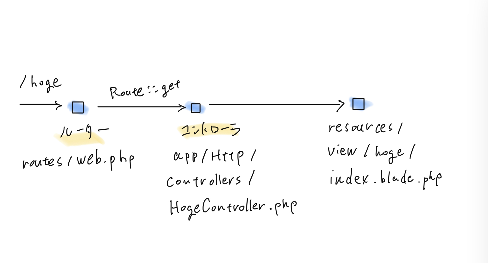

# Laravel リクエストを受け取り HTML を表示

クライアントから GET リクエストを受け取り HTML を返す一連の流れの構築方法について記載. <br>

## 環境

* macOS Big Sur
    * 11.6.5
* Docker
    * 20.10.12
* Laravel
    * 9.21.5
* PHP
    * 8.1.8
* Composer
    * 2.3.10
* MySQL
    * 8.0.29

## 参考

* プロフェッショナルWebプログラミング Laravel
    * 書籍
    * ISBN:978-4-295-20283-7

## 概要

Laravel での実装方法の大まかな流れは以下となる. <br>

1. コントローラを作成する
1. HTML のテンプレートを作成する
1. 作成したコントローラに HTML 表示の実装を追加する
1. ルータに作成したコントローラへのルーティングを追加する


## コントローラを作成する

Artisan で自動作成. <br>

```
$ sail artisan make:controller HogeDir/HogeController
```
上記で `app/Http/Controllers/HogeDir/HogeController.php` が作成される. <br>


ひとつのコントローラにひとつのエンドポイントの制約を課したい場合は以下のコマンド. <br>

```
$ sail artisan make:controller HogeController --invokable
```

自動生成されたコントローラには `__invoke` メソッドが定義され, このメソッドにしかリクエスト処理ができないよう制約を付与できる. <br>


## HTML のテンプレートを作成する

Blade という動的に HTML を作成するテンプレートを使用する. <br>

`resources/views/hoge/index.blade.php` を作成する. <br>
Blade は `{{ $hoge }}` の記述で動的に値を設定できる. <br>

例
```html
<!doctype html>
<html lang="ja">

<head>
    <meta charset="UTF-8">
    <meta name="viewport" content="width=device-width, user-scalable=no, initial-scale=1.0,
          maximum-scale=1.0, minimum-scale=1.0">
    <meta http-equiv="X-UA-Compatible" content="ie=edge">
    <title>アプリタイトル</title>
</head>

<body>
    <h1>アプリボディ</h1>
    <p>{{ $hoge }}</p>
</body>

</html>
```

## 作成したコントローラに HTML 表示の実装を追加する

先程作成した HogeController.php に表示用のメソッドを追加する. <br>
シングルアクションコントローラの場合は `__invoke` メソッドに実装する. <br>

作成したメソッド内で `view` をコールし HTML を返す. <br>
第一引数は表示する HTML テンプレートでドット区切りでフォルダ階層を表す. <br>
以下の場合は `hoge` フォルダの `index.blade.php` を指定. <br>

第二引数は動的に表示する変数({{ $hoge }})の変数名と値. <br>

通常のコントローラ場合
```php
// メソッド名は任意
public function show()
{
    // 変数 hoge に laravel という文字列を設定
    return view('hoge.index', ['hoge' => 'laravel']);
}
```

シングルアクションコントローラの場合
```php
public function __invoke(Request $request)
{
    // 変数 hoge に laravel という文字列を設定
    return view('hoge.index', ['hoge' => 'laravel']);
}
```

## ルータに作成したコントローラへのルーティングを追加する

ルータ(routes/web.php)にルーティングを追加する. <br>

* 通常コントローラ
    * `Route::get('/hoge', [\App\Http\Controllers\HogeController::class, 'show']);`
    * hoge は アクセスされる URL のパス
    * `HogeController` は作成したコントローラ
    * show はアクセスするメソッド
* シングルアクションコントローラ
    * `Route::get('/hoge', \App\Http\Controllers\HogeController::class);`
    * シングルアクションコントローラの場合メソッドの指定は不要


## おわり

`sail up -d` でサーバを立ち上げた状態でブラウザから `http://localhost/hoge` にアクセスすると作成した HTML にアクセスできる. <br>
ルーティングのイメージは大まかに以下の感じ. 


