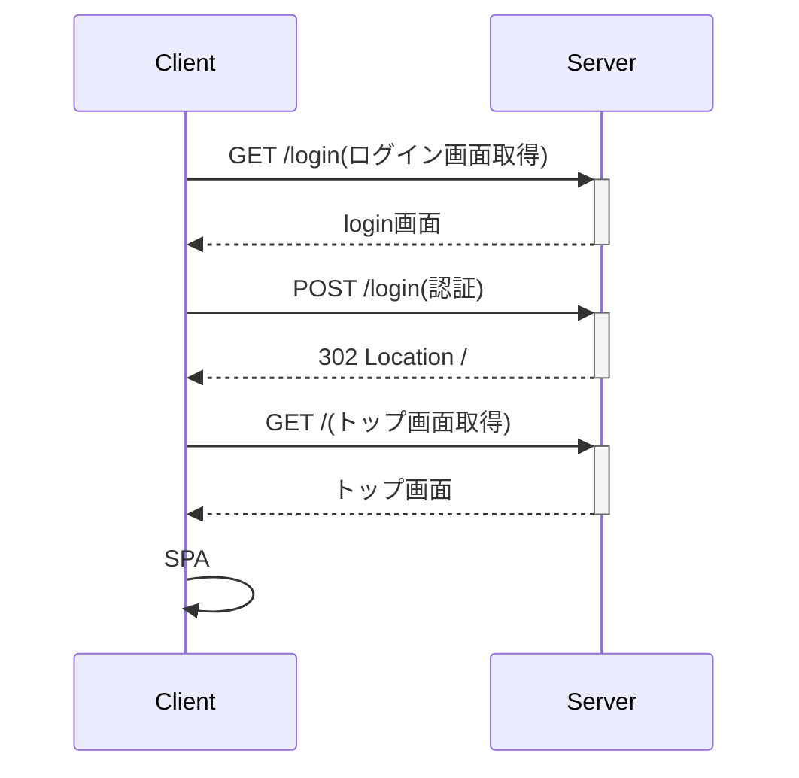

# LaravelでSPA認証を実装する

## 概要

LaravelでのSPA認証の実装方法の覚書。
使用技術は以下の通り。

- 手動による認証+SanctumによるSPA認証
- セッション+クッキー認証

## 環境

- Laravelのバージョン(9.x)
- Sanctumのバージョン
- Vue.jsのバージョン
- PHPのバージョン

## 参照ドキュメント

- Laravel 9.x Laravel Sanctum
  - https://readouble.com/laravel/9.x/ja/sanctum.html
 
## 認証の流れ

1. ログイン
2. APIを認証で保護する

## 構成

今回はログイン画面はSSRで実装しログイン後はSPAとなる構成としている。



## 実装手順

1. ログインの実装
    1. ログイン画面はSSRで実装する
2. ログアウトの実装
3. ルートを認証で保護する
4. フロントの実装
    1. ログインはSSR
    2. ログアウトはAPI
    3. Sanctumの準備

### ログインの実装

#### ログインAPIの実装

ログイン用のコントローラを実装する。実装コードはほぼ以下URLの「ユーザーを手作業で認証する」の通り実装。コード中の詳細についてもリンク先を参照。

https://readouble.com/laravel/9.x/ja/authentication.html

```php
<?php

namespace App\Http\Controllers;

use Illuminate\Contracts\View\View;
use Illuminate\Http\Request;
use Illuminate\Http\RedirectResponse;
use Illuminate\Support\Facades\Auth;

class LoginController extends Controller
{
    /**
     * 認証の試行を処理
     */
    public function authenticate(Request $request): RedirectResponse
    {
        $credentials = $request->validate([
            'email' => ['required', 'email'],
            'password' => ['required'],
        ]);

        if (Auth::attempt($credentials)) {
            $request->session()->regenerate();

            return redirect()->intended('/');
        }

        return back()->withErrors([
            'email' => 'The provided credentials do not match our records.',
        ])->onlyInput('email');
    }
}
```

`web.php`にルーティングを追加する。

```php
Route::post('/login', [LoginController::class, 'authenticate']);
```

#### ログイン画面の実装

ログイン画面はSSRで実現するためLaravelのBladeを使用する。

`resources/views/login.blade.php`を作成する

```blade
<!DOCTYPE html>
<html lang="{{ str_replace('_', '-', app()->getLocale()) }}">

<head>
    <meta charset="utf-8" />
    <meta name="viewport" content="width=device-width, initial-scale=1" />

    <title>Login</title>
</head>

<body>
    <section>
        <h1>Login</h1>

        <div>
            <form action="{{ url('/login') }}" method="POST">
                {{ csrf_field() }}
                <div>
                    <p>email</p>
                    <input type="email" name="email" value="{{ old('email') }}" required autofocus>

                    @error('email')
                        <div>
                            {{ $message }}
                        </div>
                    @enderror

                </div>
                <div>
                    <p>password</p>
                    <input type="text" name="password">
                </div>
                <div>
                    <!-- 送信ボタン -->
                    <input type="submit" value="送信">
                </div>
            </form>
        </div>

    </section>

</body>

</html>
```

- `form`タグで先ほど作成した認証ルートにCSRFトークン付きでPOST
- 認証がエラーした場合はフラッシュメッセージとして`@error('email')`部分を表示

ログイン画面のコントローラを作る。`LoginController.php`に以下のメソッドを追加する。

```php
    public function index(): View
    {
        return view('login');
    }
```

`web.php`にルーティングを追加する。
```php
Route::get('/login', [LoginController::class, 'index'])->name('login');
```
#### ログイン先の画面を作る

ログイン成功時の遷移先の画面を作る。`resources/views/index.blade.php`を作る。後ほどSPAログインに変更する際にまた書きかえるので一旦は遷移したことがわかる程度の内容にする。

```blade
<! DOCTYPE html>
<html>
<head></head>
<body>
    <div>ログインしました</div>
</body>
</html>
```

`web.php`にルーティングを追加する。

```php
Route::get('/', function () {
    return view('index');
});
```

### ログアウトの実装

#### ログアウトの処理を作成する

コントローラの作成。
これも基本的には以下の参照先に記載の「ログアウト」の項目の通り実装する。

https://readouble.com/laravel/9.x/ja/authentication.html

```php
<?php

namespace App\Http\Controllers;

use Illuminate\Http\Request;
use Illuminate\Http\RedirectResponse;
use Illuminate\Support\Facades\Auth;

class LogoutController extends Controller
{
    /**
     * ユーザーをアプリケーションからログアウトさせる
     */
    public function logout(Request $request): RedirectResponse
    {
        Auth::logout();

        $request->session()->invalidate();

        $request->session()->regenerateToken();

        return redirect('/login');
    }
}
```

- セッションを無効にする
- CSRFトークンを初期化する
- ログアウト後の画面にリダイレクトする

コントローラが完成したら`web.php`にルーティングを追加する。
```php
Route::post('/logout', [LogoutController::class, 'logout']);
```

#### ログアウトボタンを画面に追加する

ログアウトするためのボタンを`index.blade.php`に追加する。

```blade
<! DOCTYPE html>
<html>
<head></head>
<body>
    <div>ログインしました</div>
    <div>
        <form action="{{ url('/logout') }}" method="POST">
            {{ csrf_field() }}
            <div>
                <input type="submit" value="ログアウト">
            </div>
        </form>
    </div>
</body>
</html>
```
ログイン後、ログアウトボタンを押すとログイン画面にリダイレクトされればOK。

### ルートを認証で保護する

ログイン状態でないと`/`にはアクセスできないように`web.php`実装する。
参照先の「ルートの保護」の通り実装する。

```php
Route::get('/', function () {
    // 認証済みユーザーのみがこのルートにアクセス可能
    return view('index');
})->middleware('auth');
```

`->middleware()`の追加でこのルートには認証済みのユーザしかアクセスできないようになる。

### フロントの実装

ここまででSSRによる認証の機構は完成したので、最終のゴール地点である「ログインまでSSRで行いログイン後はSPAとして動かす」
ところまでを実装する。なお、フロントのフレームワークとしてはVue.jsを使用するが、こちらの細かい実装内容については割愛する。

`index.blade.php`にVueを埋め込めるよう変更した上、`resources/js/components/App.vue`を以下の通り実装する。

```vue
<template>
    <div>
        <p>Vueのページ</p>
    </div>
    <div>
        <button type="button" v-on:click="logout"> ログアウト </button>
    </div>
</template>

<script lang="ts" setup>
import axios from "axios";

const logout = (): void => {
    axios.post("logout");
    window.location.href = "/login";
};
</script>
```

ログアウトをリクエスト後、`window.location.href`を更新してフロント側で自前でロケーションを切り替える必要がある。

#### Sanctumについて

フロント側で認証する場合、Sanctumによる以下の手順が必要だが。

1. Sanctumのミドルウェアを`app/Http/Kernel.php`に追加
1. ログイン前に`sanctum/csrf-cookie`にアクセスしCSRFトークンを初期化
    - `XSRF-TOKEN`を取得する
1. リクエスト時に`XSRF-TOKEN`をヘッダに付与する
1. ログイン後にアクセスするルーティングをSanctumミドルウェアで保護する

1に関しては自分の環境ではLaravelにデフォルトで設定されていた。
`throttle:api`が該当。

`app/Http/Kernel.php`
```php
        'api' => [
            // \Laravel\Sanctum\Http\Middleware\EnsureFrontendRequestsAreStateful::class,
            'throttle:api',
            \Illuminate\Routing\Middleware\SubstituteBindings::class,
        ],
```

2の`sanctum/csrf-cookie`のルーティングもデフォルトで設定されている。
また、初めのSSRの認証時にCSRFトークンを取得するため、特に以下へのアクセスは本手順では不要。

php artisan route:list
```
  GET|HEAD   sanctum/csrf-cookie ............................................... sanctum.csrf-cookie › Laravel\Sanctum › CsrfCookieController@show

```

3のトークンの付与は`axios`などのライブラリを使用した場合自動で付与してくれる。<br>

4のログイン後にアクセスするルーティングの保護は`routes/api.php`にデフォルトで参考となるソースがあるためこちらを元に実装する。


```php
Route::middleware('auth:sanctum')->get('/user', function (Request $request) {
    $user = $request->user();
    return $user->toRistrictedArray();
});
```

以上でLaravelによるSPA認証の実装が完了。
